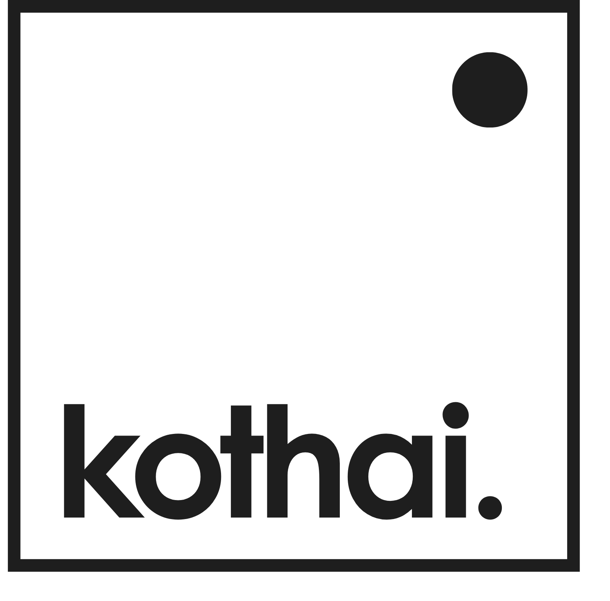

<div align="center">



### Save now. Remember later.

Everything you save gets read and filed by a model running on your own machine.
Later you ask it questions in plain English, and it answers from your own stuff
rather than the open web.

[Quick start](#quick-start) · [How it works](#how-it-works) · [Documentation](#if-you-want-to) · [Self-hosting](docs/self-hosting.md) · [API](docs/api.md)

[](https://github.com/IbrahimTareq/kothai/releases)
[](https://github.com/IbrahimTareq/kothai/pkgs/container/kothai)
[](https://github.com/tetherto/qvac)
[](LICENSE)
[](https://github.com/IbrahimTareq/kothai/commits/main)

`no cloud` · `no account` · `no API key` · `runs on a Raspberry Pi`

<!-- Demo GIF goes here. Record the capture, enrich and ask loop, drop it in
     docs/assets/demo.gif, and uncomment:

-->

</div>

---

Saving is a solved problem. Every app has a bookmark button and every chat has
a note to self. What never works is coming back three weeks later and actually
finding the thing again.

Kothai is the finding half. You throw links, screenshots and half-formed
thoughts at one box. Each one shows up straight away, and a local model reads it
in the background: gives it a title, writes a summary, picks tags then turns it
into a vector so you can search by meaning instead of exact words. Weeks later
you flip the same box into Ask and put questions to the pile. Answers are built
only from what you saved and every claim points back at the card it came from.

In case you're wondering, Kothai is Bengali for "where". It's the question you end up asking
when you're trying to find something which is the problem this is built around.

## Features

- **Two-phase saving.** A card appears the moment you hit Enter, and the models catch up in the background. The UI never sits waiting on inference.
- **Ask your archive.** Cosine similarity and keyword search both run, and the top cards go to the language model. It has to cite each one by number. If nothing matches, it says so instead of making something up.
- **Images count as notes.** Drop a screenshot and a vision model writes a caption for it, so it shows up in search like anything else.
- **Links turn into cards.** Page metadata gets fetched once and cached. YouTube captions and full article text come along too, which makes videos and long reads far easier to find later.
- **Spaces.** Collections of items, optionally with a tag rule that files matching notes automatically. Any Space can be viewed as a radial mindmap.
- **Swappable models.** Three slots, all changeable while the app is running. Swap the embedding model and the library re-indexes itself.
- **Tunable memory.** Each model role can be always on, on demand, or off. Turn all three off and you have a working bookmark manager on a 1 GB box.
- **Runs on modest hardware.** A Raspberry Pi 5 handles the small models fine. There's also a 250 MB lite image that does no inference itself and talks to any OpenAI-compatible endpoint.
- **Your data stays yours.** One SQLite file on disk, JSON export in a click, and hot database backups that need no downtime. No account, no telemetry.

## Quick start

**Docker.** The easy path, and what runs well on a Pi. The wizard checks your
hardware, asks three questions, and starts everything:

```bash
curl -fsSLO https://raw.githubusercontent.com/IbrahimTareq/kothai/main/scripts/init.mjs && node init.mjs
```

Prefer to do it by hand? The compose file below is what the wizard would write:

```bash
curl -O https://raw.githubusercontent.com/IbrahimTareq/kothai/main/docker-compose.yml
docker compose up -d
```

**From source**, if you want to work on it:

```bash
git clone https://github.com/IbrahimTareq/kothai.git
cd kothai
corepack enable      # provides the pnpm version pinned in package.json
pnpm install
pnpm start           # builds the client, then serves on :5173
```

**Lite**, about 250 MB, no weights, bring your own endpoint:

```bash
docker run -d --name kothai -p 5173:5173 -v ./data:/app/data \
  -e STASH_AI_PROVIDER=remote \
  -e STASH_AI_BASE_URL=http://ollama:11434/v1 \
  ghcr.io/ibrahimtareq/kothai:lite
```

Then:

1. Open <http://localhost:5173>.
2. Pick your models on the first run, or hit "Skip for now" to go without any and turn them on later.
3. Start pasting while the weights download, which is about 3.3 GB for the defaults. The app works throughout. Anything you save meanwhile keeps its quick heuristic version and gets enriched once the models are up.
4. Wait for the progress bar to say Ready. Classification and Ask switch themselves on at that point.
5. Flip the box to Ask and start asking.

## How it works

Everything else follows from one decision: saving happens in two phases.

Phase one writes the note the moment you hit Enter, guessing its type and title
with cheap regex. Phase two is a background queue that fetches link metadata,
captions images, classifies the note properly and embeds it then patches the
card in place.

Keeping the two apart is what makes the rest work. The UI never waits on a
model. A model that's slow, still downloading or switched off leaves you with
the phase-one version rather than an error. And pasting twenty links at once
doesn't have them fighting over the same weights.

## If you want to…

| | … then read |
|---|---|
| **understand how it works** before changing anything | [Architecture](docs/architecture.md) |
| **set up a dev environment** and run the tests | [Development](docs/development.md) |
| **add a route, an importer, or a model preset** | [Development → Recipes](docs/development.md#recipes) |
| **call the API** from a script or another client | [HTTP API](docs/api.md) |
| **understand the AI layer**: roles, residency, RAM | [Models & inference](docs/models.md) |
| **run it on your own hardware** | [Self-hosting](docs/self-hosting.md) |
| **expose it beyond your LAN** | [Security](docs/security.md) |
| **touch any CSS** | [Design system](docs/design-system.md) |

## Contributing

Issues and PRs are welcome. The server stays thin on purpose: no framework, no
ORM, no build step. Open an issue first for anything sizeable so we can agree on
the shape. AI-assisted PRs are fine as long as a human has actually read them. The conventions worth knowing before you write code are in
[docs/development.md](docs/development.md#conventions).

## License

Released under [AGPL-3.0](LICENSE).
