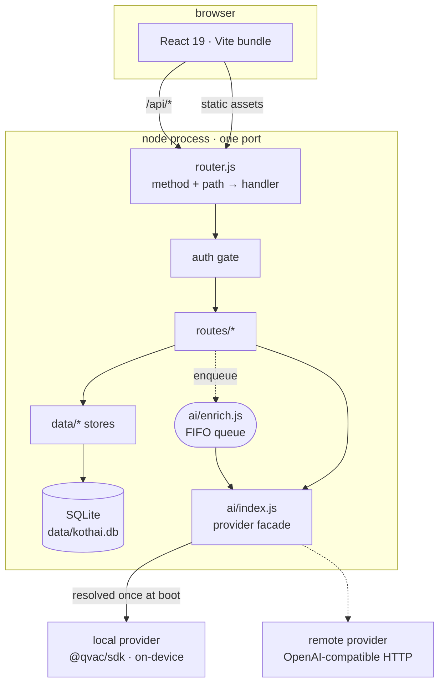
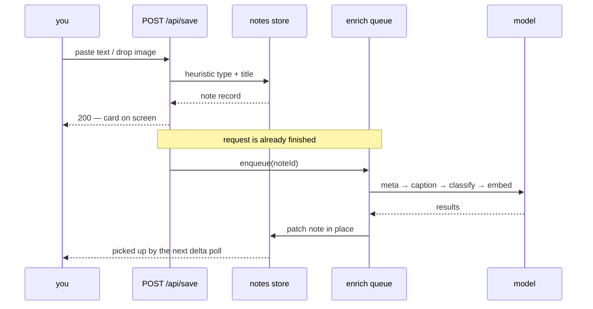
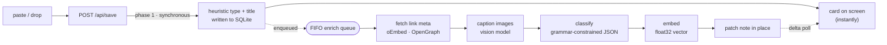

# Architecture

How Kothai is put together, and — more usefully — *why*. Read this before
changing anything structural.

- [The shape of it](#the-shape-of-it)
- [Project layout](#project-layout)
- [The two-phase save](#the-two-phase-save)
- [The enrich queue](#the-enrich-queue)
- [Storage](#storage)
- [Retrieval](#retrieval)
- [Delta sync](#delta-sync)
- [The inference facade](#the-inference-facade)
- [The client](#the-client)
- [Boot sequence](#boot-sequence)
- [Deliberate limits](#deliberate-limits)

## The shape of it



One Node process serves both the built client and the JSON API on a single
port. There is no framework, no ORM, no reverse proxy requirement and no build
step on the server — `server/` is plain ESM that Node runs directly.

**Runtime dependencies, all five of them:** `@qvac/sdk` (on-device inference,
absent in the lite image), `@extractus/oembed-extractor` and `linkedom` +
`@mozilla/readability` (link previews and article text), `youtube-transcript`
(captions as retrieval fuel). ZIP reading, HTTP plumbing, session signing and
SSRF checks are all hand-rolled in `server/lib/` rather than pulled in.

## Project layout

Two halves. A TypeScript client bundled by Vite, and a Node ESM server that
serves that bundle and owns the JSON API.

```
client/                 React 19 + TypeScript, bundled by Vite
├─ app/                 main.tsx · App.tsx (the shell) · router.ts
├─ views/               full screens: Core (ask), Gallery, Spaces, Expanded,
│                       Settings, Onboarding
├─ components/          Board, Capture, Cards, Mindmap, Carousel, Chats,
│                       ModelPicker, Tweaks, icons
├─ data/                api.ts · pager.ts · useNotes.ts    ← server talk
├─ domain/              detect · source · importFile       ← pure rules
├─ layout/              masonry · carousel · mindmap       ← pure geometry
├─ util/                format · markdown
└─ styles/              foundation/ · components/ · views/ (see design-system.md)

server/                 dependency-light Node ESM, serves ./dist
├─ index.js             boot: resolve provider, load stores, listen
├─ router.js            method + path → handler, and the auth gate
├─ config.js            every env var resolved in one place
├─ routes/              API by domain: notes, ask, chats, collections,
│                       settings, import, export, backup, wipe, auth
├─ ai/                  index.js (facade) · roles.js (residency + lifecycle)
│  │                    enrich.js (the queue) · meta.js · prompts · normalise
│  │                    presets · backlog · circuit
│  └─ providers/        local.js (QVAC, on-device) · remote.js (OpenAI-compat)
├─ data/                db.js (SQLite) · notes · chats · collections ·
│                       settings · tagvocab · query · embedding · migrate
├─ import/              importer registry: Instagram today
└─ lib/                 http · auth · ssrf · tags · zip

test/                   mirrors the source tree · 789 tests, node:test
docs/                   the detail, indexed in README.md
data/                   your notes, uploads, kothai.db      (git-ignored)
models/                 cached model weights                (git-ignored)
dist/                   built client, served by the server  (git-ignored)
```

The client layer split is by what a module is allowed to touch, covered under
[The client](#the-client). The server's one-place-per-concern rule is the same
idea: every env var resolves in `config.js`, every route registers in
`router.js`, every model call goes through `ai/index.js`.

## The two-phase save

This is the single decision the rest of the design hangs off.



**Phase one** (`server/routes/notes.js` → `handleSave`) runs inside the request.
It writes the note using regex/heuristic guesses for type and title — the same
pure functions the client uses to preview them (`ai/normalise.js`:
`heuristicType`, `deriveTitle`, `isLikelyUrl`).

**Phase two** (`server/ai/enrich.js`) is a background FIFO chain.

What this buys:

| | |
|---|---|
| **The UI never blocks on a model** | The save response doesn't await inference at all. |
| **Failure degrades, it doesn't throw** | Any enrich step that errors leaves the heuristic version in place. A note is never lost because a model was busy, mid-download or turned off. |
| **Rapid saves don't contend** | One job at a time means paste-twenty-links doesn't thrash the weights. |
| **Models can be absent entirely** | With every role `off`, Kothai is a functioning bookmark manager. |

> [!IMPORTANT]
> If you add a step that must happen before the user sees the card, it belongs
> in phase one and it must be cheap and synchronous. Everything else goes on
> the queue. Putting an inference call in the request path is the one change
> that would break the app's core property.

## The enrich queue

`server/ai/enrich.js` holds a single promise chain:

```js
let enrichChain = Promise.resolve()

export function queueJob(fn) {
  enrichChain = enrichChain.then(fn).catch((e) => console.error('[enrich] failed:', e.message))
  return enrichChain
}
```

Everything that touches a model in the background goes through it — per-note
enrichment, the settings re-embed, retag-all, the metadata backfill. That's
deliberate: a re-embed that ran concurrently with in-flight enrichment would
race the same records.

End to end, from paste to enriched card:



Steps a note may go through, in order:

1. **Metadata** — oEmbed + OpenGraph via `ai/meta.js`, cached locally. YouTube
   captions and article text (`@mozilla/readability`) get pulled in here too,
   because they're far better retrieval keys than a title.
2. **Thumb vision** — any note carrying a thumbnail gets it described by the
   vision model. Short-form video covers carry burned-in hook text, and
   transcribing it is often the single best retrieval key the video has.
3. **Image caption** — for image notes.
4. **Classify** — the language model, with `responseFormat: json_schema`, so
   the output is *grammar-constrained* to the schema and parsing cannot fail.
5. **Embed** — a float32 vector over a defined recipe of fields.

Which steps a given note still needs is computed by `ai/backlog.js` — a pure
module with no I/O, which is also what powers the "backlog" count in Settings.
Completed steps are recorded as `ai.*` markers on the note so work is never
repeated.

> [!TIP]
> `thumbVision` is keyed on the *artifact* (a thumbnail with no description)
> rather than on its marker, because the notes that need it most are exactly
> the ones whose marker lies — described back when the description was thrown
> away instead of stored. See the comment at the top of `ai/backlog.js`.

## Storage

**SQLite through `node:sqlite`** — Node's built-in, no driver, no daemon. One
file: `data/kothai.db`. `DatabaseSync` is fully synchronous (it's embedded,
there's no round-trip), so every store does plain sync reads and writes; only
the first open is async, because it has to ensure `data/` exists and run the
one-time legacy-JSON import.

Five tables: `notes`, `collections`, `chats`, `settings`, `tag_vocab`.

Three schema decisions worth knowing before you touch it:

<details>
<summary><b>Why most fields live in one JSON <code>data</code> column</b></summary>

Notes pick up fields over time from `ai/meta.js` and `ai/enrich.js`
(`siteTitle`, `thumb`, `pending`, `ai` markers, …). A fixed column set would
silently drop anything future code adds. `settings` and `tag_vocab` are the
exception — both have a small, genuinely fixed shape, so real columns are
simpler there.

</details>

<details>
<summary><b>Why <code>embedding</code> is the one field <i>not</i> in that blob</b></summary>

A 1024-dim vector costs ~20 KB as decimal text. Because enrichment patches one
field at a time, the whole JSON blob — vector included — was being rewritten on
every unrelated update. Pulling it out into its own nullable BLOB column fixed
that.

</details>

<details>
<summary><b>Why embeddings are float32 bytes, not JSON</b></summary>

A 768-dim vector is ~15 KB as decimal text and 3 KB as float32. float32 is what
the models emit anyway, and cosine ranking is unaffected by the last digits of
mantissa. On a real 1,686-note install, `tag_vocab` alone held 2,663 vectors as
JSON text — 41.5 MB of a 51.5 MB database.

`decodeEmbedding` **copies** rather than views the BLOB: `node:sqlite` can
return a `Uint8Array` at an arbitrary byte offset, and `Float32Array` can't be
constructed over an offset that isn't a multiple of 4. That copy is a
correctness fix, not an oversight.

</details>

Notes are held in an in-memory array as well as on disk, so `allNotes()`,
`search()` and `textSearch()` stay synchronous. SQLite is the durability layer;
the array is the query layer.

**Migration.** `data/migrate.js` imports the old flat-JSON store on first boot
and renames each file to `<name>.migrated` — kept, not deleted, so an
unexpected shape leaves evidence on disk. Every insert is `INSERT OR IGNORE`, so
a crash mid-migration is safe to retry.

## Retrieval

Ask uses **hybrid retrieval**, in `server/data/notes.js`:

```
query ──┬─→ embed → cosine over all vectors → ranked list ─┐
        │                                                  ├─→ reciprocal rank
        └─→ keyword pass over content/title/tags/host ─────┘    fusion → top k
```

`reciprocalRankFusion` scores each document by the sum of `1/(k + rank)` across
the lists it appears in, so a card that both searches agree on outranks one only
either found. This matters because embeddings are weak on exact tokens — a
model name, an error string, a person's handle — and keyword search is weak on
paraphrase.

The retrieved cards are the *only* context the language model gets, and the
prompt (`ai/prompts.js`) requires it to cite each by number. Below the
similarity floor, nothing is retrieved and the answer says so rather than
inventing one.

Cosine search runs over the in-memory array — linear, and honest to a few
thousand items. Past that, `server/data/notes.js` is the one seam to swap for a
real vector index.

## Delta sync

The client pages notes rather than fetching them all, so it needs "what changed
since I last looked". `data/notes.js` keeps a monotonic `rev` counter and a
per-boot `bootId`:

- Every mutation bumps `rev` and stamps `_rev` on the in-memory record. `_rev`
  is never persisted and is stripped from every response.
- Deletions leave tombstones `{ id, rev }`, capped at 1000.
- `GET /api/notes/delta?since=<rev>&boot=<id>` returns changed notes + deleted
  ids — **unless** the `bootId` doesn't match (server restarted) or `since`
  predates the trimmed tombstone window, in which case it returns
  `{ resync: true }` and the client refetches.

Refusing to serve a delta it can't guarantee is the point: a partial answer the
client silently trusts is worse than an honest resync.

## The inference facade

Everything model-shaped goes through `server/ai/index.js`. It resolves exactly
one provider at boot via **dynamic** `import()`:

```js
if (kind === 'remote') return await import('./providers/remote.js')
return await import('./providers/local.js')
```

That dynamic import is load-bearing, not stylistic. In the lite image
`@qvac/sdk` isn't installed at all, and a static import here would crash the
process at startup.

Both providers satisfy the same contract, enforced by
`test/server/ai/providers/provider-contract.test.js`. Prompt construction and
result normalisation live in shared pure modules (`ai/prompts.js`,
`ai/normalise.js`), so a note classified remotely is asked the same question and
filtered the same way as one classified on-device.

Details of roles, residency and the RAM story are in [Models &
inference](models.md).

## The client

One `<App>` switching on a `nav` string. Routing is therefore just a bijection
between that string and the pathname, which is why `client/app/router.ts` is
sixty lines and has no dependency.

The layer split is by **what a module is allowed to touch**:

| Layer | Rule |
|---|---|
| `app/` | The shell — state, effects, navigation. |
| `views/` | Full screens. |
| `components/` | Reusable UI. |
| `data/` | The only place that talks to the server. |
| `domain/` | Pure rules — type detection, source classification, upload validation. |
| `layout/` | Pure geometry — masonry packing, carousel maths, mindmap radial layout. |
| `util/` | Pure formatting. |

`domain/`, `layout/` and `util/` import nothing from React and nothing from the
network, which is why they're unit-tested directly with `node:test` and no
browser.

**The board is windowed.** `components/Board.tsx` + `layout/masonry.ts` render
only visible cards. The previous version put every card in the DOM and
re-measured all of them each pass — 1,675 cards meant 42k DOM nodes and about
20 seconds of blocked main thread.

`domain/source.ts` and `server/data/query.js` both classify a note's platform,
and that duplication is intentional (client filtering, server facet counts).
They're kept honest by a parity test — if you add a platform, add it to both.

## Boot sequence

`server/index.js`, in order:

1. Create `models/`, write `qvac.config.json` with a `cacheDirectory`, and set
   `QVAC_CONFIG_PATH` — **before** anything imports the SDK, so weights land in
   the project rather than your home directory. Every subsequent import is
   dynamic for exactly this reason.
2. Load the stores (notes, chats, settings, collections, tag vocab).
3. `initProvider()` — resolve local or remote, pass both halves of the saved
   model selection; each provider reads only its own.
4. Apply residency, queue the metadata backfill, and queue a library re-embed
   if the embedding recipe changed (vectors built under a different recipe
   aren't comparable with new ones).
5. Listen. Log whether a password is set — both ways round, because "no
   password" is the default and is exactly the thing to notice before pointing
   a public hostname at it.
6. Boot the always-resident models in the background, *only* if the install is
   already configured. A fresh install downloads nothing until you pick models
   in the first-run flow.

## Deliberate limits

Things that look like omissions and aren't:

- **Single user.** No accounts, no per-user separation. `STASH_PASSWORD` is one
  shared password, designed to make a public URL safe — not to model identity.
- **Linear vector search.** Fine to a few thousand notes. Swap
  `data/notes.js` when it isn't.
- **One enrich job at a time.** Concurrency here would contend for the same
  weights on the hardware this targets.
- **No rate limiting.** See [Security](security.md).
- **Imports serialize against each other only**, not against the whole store —
  two overlapping imports would each dedup against a stale snapshot.
