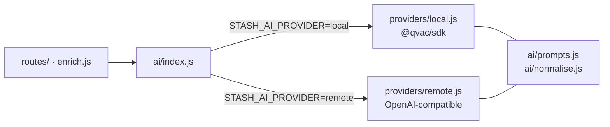

# Models & inference

Three model roles, two providers, one facade. This is the part of Kothai that
decides how much RAM it uses and how good the answers are.

- [The three roles](#the-three-roles)
- [Residency: the RAM dial](#residency-the-ram-dial)
- [Presets](#presets)
- [The provider facade](#the-provider-facade)
- [Local inference (QVAC)](#local-inference-qvac)
- [Remote inference](#remote-inference)
- [Grammar-constrained classification](#grammar-constrained-classification)
- [The embedding recipe](#the-embedding-recipe)

## The three roles

| Role | Powers | When it's off |
|---|---|---|
| **`llm`** | Classification, titles, tags, Ask answers | Notes keep their instant heuristic title; Ask is disabled |
| **`embed`** | Semantic search, Ask retrieval, tag vocabulary | Ask falls back to keyword search |
| **`vision`** | Image captions, thumbnail descriptions | Images are saved but not described |

All three are optional. With every role off, Kothai is a working bookmark
manager — that's the *"Skip for now"* path in the first-run flow, and it runs
on about 1 GB.

## Residency: the RAM dial

Each role has a **residency policy**, set in Settings → Model Cores and
implemented by `RoleManager` in [`server/ai/roles.js`](../server/ai/roles.js).

| Policy | Behaviour |
|---|---|
| `always` | Loaded at boot, never unloaded. Fastest, most RAM. |
| `ondemand` | Loaded on first use, refcounted, unloaded after an idle timeout. |
| `off` | Never downloaded or loaded. `acquire()` throws `FeatureDisabledError`. |

Defaults differ by install age, on purpose:

```js
FRESH_RESIDENCY  = { llm: 'ondemand', embed: 'always', vision: 'ondemand' }
LEGACY_RESIDENCY = { llm: 'always',   embed: 'always', vision: 'ondemand' }
OFF_RESIDENCY    = { llm: 'off',      embed: 'off',    vision: 'off' }
```

An install that predates residency gets `LEGACY` so an upgrade changes nothing
about how it behaves. Fresh installs get `embed` always-on — it's only ~300 MB
and it makes search instant — with the big models on demand.

Rough RAM, end to end:

| Setup | RAM |
|---|---|
| Everything off | ~1 GB |
| Search only (`embed: always`) | ~1.5 GB |
| **Default** (`embed` always, `llm`/`vision` on demand) | ~1.5 GB idle, more while working |
| Everything always-on, largest presets | 9+ GB |

> [!TIP]
> Being OOM-killed mid-load? Switch the language model to **Off**, not On
> demand — on demand only frees RAM after several idle minutes, so it won't
> help during a crisis.

### The lifecycle, and its sharp edges

`acquire()` / `release()` is refcounted; callers **must** pair them. Two races
`RoleManager` handles explicitly, both worth understanding before you touch it:

<details>
<summary><b>Swapping a model while a load is in flight</b></summary>

`_ensureLoaded()` captures its target *before* awaiting. If `setModel()` moves
the target meanwhile, the finished load is **discarded** rather than adopted —
otherwise you'd have the wrong weights resident under the new model's name. The
discard is routed through `_trackUnload()` so a concurrent `acquire()` waits for
the teardown instead of racing a fresh load against it.

</details>

<details>
<summary><b>Policy changes never trigger loads</b></summary>

`setPolicy()` only manages residency — actually loading is `boot()` / `warmRole()`
in the provider. That's what keeps applying settings fast and non-blocking.

</details>

## Presets

Curated per role in [`server/ai/presets.js`](../server/ai/presets.js) — pure
data, no SDK import, because the settings store needs `DEFAULTS` even in the
lite image.

| Slot | Default | Light (Pi) | Roomy (Apple Silicon) |
|---|---|---|---|
| **Language** | Qwen3 1.7B | Qwen3 0.6B · Llama 3.2 1B | Qwen3 4B · Qwen3 8B (16 GB) |
| **Embedding** | EmbeddingGemma Q8 | EmbeddingGemma Q4 | GTE Large |
| **Vision** | Qwen3.5-VL 2B | SmolVLM2 0.5B | Qwen3.5-VL 4B |

On a Raspberry Pi 5 the light trio is about 1.5 GB all-in and stays responsive
— expect a few tokens per second, which is plenty for short answers and isn't
meant to be a chat firehose. On an M-series Mac the defaults feel instant and
the 4B language model is a free step up in classification quality.

All three are swappable live from Settings. Change the **embedding** model and
the whole library re-indexes itself in the background.

## The provider facade

[`server/ai/index.js`](../server/ai/index.js) is the only module the rest of the
app imports for inference. It resolves exactly one provider at boot:



Both providers share prompt construction and result normalisation, so a note
classified remotely is asked the same question and filtered the same way as one
classified on-device. The shared surface is enforced by
`test/server/ai/providers/provider-contract.test.js`.

Selection is always explicit and **fails soft**: an unknown `STASH_AI_PROVIDER`
value falls back to `local` rather than refusing to boot, so a typo degrades to
the historical behaviour. The one loud failure is asking for `local` in the lite
image, where the error names the fix.

## Local inference (QVAC)

On-device via [`@qvac/sdk`](https://github.com/tetherto/qvac). The whole AI
surface is four calls:

| Call | Used for |
|---|---|
| `loadModel({ modelSrc, modelType, onProgress })` | Pulls weights from the QVAC registry with live progress. Vision adds `projectionModelSrc` for its mmproj. |
| `completion({ modelId, history, responseFormat })` | Classification and answers. Vision attaches the file via `attachments: [{ path }]`. |
| `embed({ modelId, text })` | Vectorises every saved item and every question. |
| `unloadModel` / `close` | Drops idle models, shuts down cleanly. |

Weights live in `./models/`. `server/index.js` writes `qvac.config.json` with a
`cacheDirectory` and sets `QVAC_CONFIG_PATH` **before** the SDK is imported, so
downloads land in the project rather than your home directory. Every import
after that line is dynamic for exactly this reason.

## Remote inference

Set two env vars and any OpenAI-compatible `/v1` endpoint works — Ollama,
llama.cpp server, vLLM, OpenAI, OpenRouter:

```bash
STASH_AI_PROVIDER=remote
STASH_AI_BASE_URL=http://localhost:11434/v1
STASH_AI_API_KEY=…        # not needed for Ollama or llama.cpp
```

Model **names** are picked in Settings (they differ per endpoint). Credentials
are **env-only** — never written to SQLite, never returned by any API response,
so they can't leak through a backup or an export. `/api/settings` echoes only
the endpoint's *hostname*, never the full URL, because some providers carry
credentials in the URL path.

### The circuit breaker

Remote calls go through [`Circuit`](../server/ai/circuit.js) — 5 consecutive
failures opens it for a 60-second cooldown. Only the remote provider has one:
local inference fails per-call, never systemically, so there's nothing to trip.

Two details:

- Failures marked `{ transient: false }` — bad API key, unknown model name —
  open the circuit **immediately**. Retrying can't fix a config error, and each
  retry against a metered endpoint costs money.
- After the cooldown, `allow()` returns true for a single probe while **staying
  open**. Only a success closes it, so a still-dead endpoint doesn't get
  hammered by every queued job at once.

A config-fixable failure reuses `FeatureDisabledError` with an override code, so
routes and the client have one error shape to handle whether a feature is off by
policy or broken by configuration.

## Grammar-constrained classification

Classification passes a JSON schema as `responseFormat`, which constrains the
model's **grammar** rather than merely asking it nicely. The output is
structurally valid by construction — parsing cannot fail, so there's no
retry-on-malformed-JSON path to maintain.

The model still needs supervision on *content*, which is what
[`ai/normalise.js`](../server/ai/normalise.js) is for: dropping junk tags,
clamping lengths, stripping `<think>` blocks from reasoning models.

## The embedding recipe

A note's vector is built from a defined set of fields (`EMBED_RECIPE` in
`ai/prompts.js`), and the query gets its own task prefix.

Vectors built under an *older* recipe — different prefixes, or a different set
of fields — aren't comparable with new ones. So the recipe is versioned, and a
change triggers a one-time background re-embed of the whole library on the same
FIFO queue as everything else (`enrich.queueRecipeReembed()`, called at boot).

> [!IMPORTANT]
> If you change what goes into an embedding, bump the recipe. A library holding
> two incompatible vector generations silently returns bad search results, and
> nothing will tell you.
